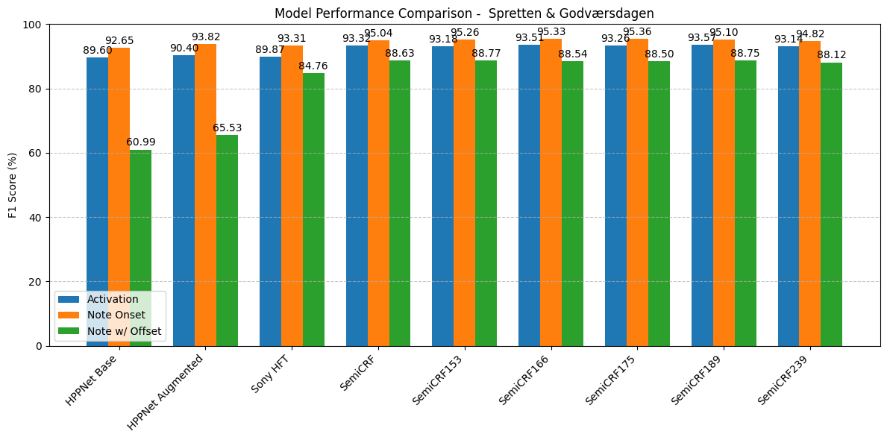

# Automatic Music Transcription Evaluation

This repository contains evaluation tools and MIDI files for measuring F1 scores of our automatic music transcription model. The evaluation framework is implemented in Google Colab, providing a cloud-based environment for transparent assessment of model performance and detailed inspection of the evaluation process.

## Features

- Cloud-based evaluation environment
- Pre-selected MIDI test files
- F1 score calculation implementation
- Interactive result inspection
- Reproducible evaluation process

## Getting Started

### Prerequisites

- Google account
- Web browser
- Internet connection
- Human being

### Running the Evaluation

1. Open the [Google Colab notebook](https://colab.research.google.com/drive/1IRk4Zry5CuWMuUrlD-ukcGyNUwZFYqJE?usp=sharing)
2. Click "Runtime" in the top menu
3. Select "Restart and run all"
4. Follow the cell-by-cell execution to view results

## Contributing

We welcome contributions to improve the evaluation framework. Please follow these steps:

1. Fork the repository
2. Create a feature branch (`git checkout -b feature/improvement`)
3. Commit your changes (`git commit -am 'Add some improvement'`)
4. Push to the branch (`git push origin feature/improvement`)
5. Open a Pull Request

For major changes, please open an issue first to discuss your proposed changes.

## License

This project is licensed under the MIT License - see the [LICENSE](LICENSE) file for details.
