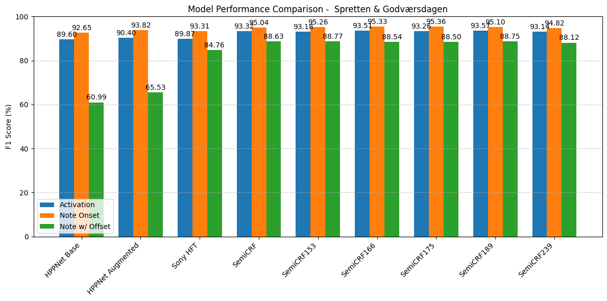

# Automatic Music Transcription Evaluation

This repository contains evaluation tools and MIDI files for measuring F1 scores of our automatic music transcription model. The evaluation framework is implemented in Google Colab, providing a cloud-based environment for transparent assessment of model performance and detailed inspection of the evaluation process.

## Features

- Cloud-based evaluation environment
- Pre-selected MIDI test files
- F1 score calculation implementation
- Interactive result inspection
- Reproducible evaluation process

## Notebooks

- `MusScribeF1Augmentation.ipynb` — broader playground: standard F1 across HPPNet, Sony HFT, Basic Pitch, and Transkun checkpoints on Spretten and Godvaersdagen, plus a final section adding strict F1 and onset/offset/pitch MAE for the post-processing stages in `postpros/`.
- `paper_evaluation.ipynb` — paper-focused: produces Table 1 of the ISMIR submission *"Raw Note Transcription for Hardanger Fiddle via a Hybrid Neural/Rule-Based Approach"*. Loads `postpros/`, runs metrics for raw / +pitch / +offset stages, and writes `table_results.csv` and `table_results.tex`.
- `eval_utils.py` — shared loader (`.mid` and post-processing CSVs), F1, and MAE helpers used by both notebooks.

## Metrics and thresholds

Note-level metrics use `mir_eval.transcription` with the standard MIREX/MAESTRO tolerances: onset ±50 ms, offset max(50 ms, 20% duration), pitch 50 cents (`raffel2014mireval`, `hawthorne2018onsets`, `hawthorne2019maestro`, `bay2009mirex`). The strict F1 is the same metric with offset tolerance reduced to max(25 ms, 5% duration); it is a sensitivity variant of the standard metric, configured through the same `mir_eval` API. See `references.bib` for the BibTeX entries.

## Getting Started

### Prerequisites

- Google account
- Web browser
- Internet connection
- Human being

### Running the Evaluation

1. Open the [Google Colab notebook](https://colab.research.google.com/drive/1IRk4Zry5CuWMuUrlD-ukcGyNUwZFYqJE?usp=sharing)
2. Click "Runtime" in the top menu
3. Select "Restart and run all"
4. Follow the cell-by-cell execution to view results

## Contributing

We welcome contributions to improve the evaluation framework. Please follow these steps:

1. Fork the repository
2. Create a feature branch (`git checkout -b feature/improvement`)
3. Commit your changes (`git commit -am 'Add some improvement'`)
4. Push to the branch (`git push origin feature/improvement`)
5. Open a Pull Request

For major changes, please open an issue first to discuss your proposed changes.

## License

This project is licensed under the MIT License - see the [LICENSE](LICENSE) file for details.
